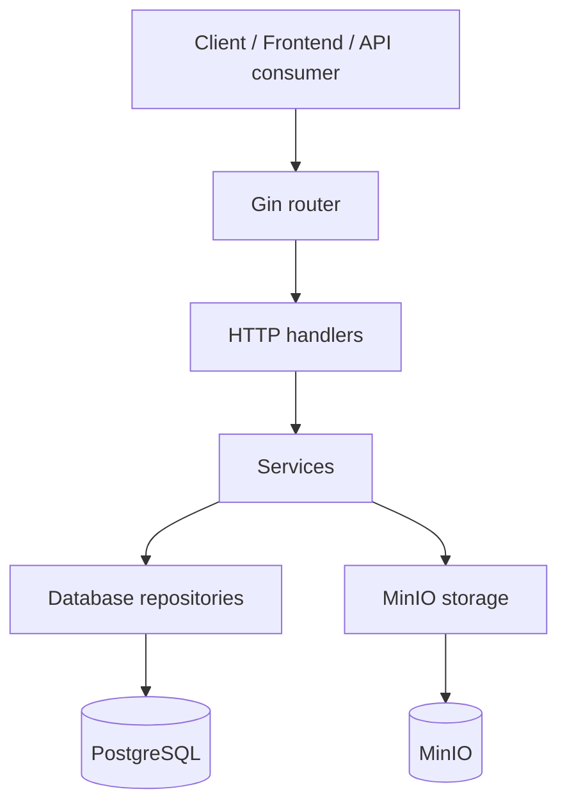

# Gocart

Gocart is a backend **REST API** for an e-commerce platform built with **Go**, **Gin**, and **GORM**. It features **JWT authentication**, **role-based authorization**, **product** and **category management**, **shopping cart** and **checkout workflows**, and **MinIO integration** for product image storage.

## Key Features

### Authentication and Users

- Register a new **customer**.
- Log in with **email** and **password**.
- Receive a signed **JWT access token**.
- Access the authenticated **profile endpoint**.
- Default role assignment is **customer**.

### Catalog Management

- Browse **products** publicly.
- Filter products by **category**, **price range**, **stock status**, and **search term**.
- Sort products by **id**, **name**, **price**, **created_at**, or **stock**.
- Browse **categories** publicly.
- **Admins** can create, update, and delete categories and products.

### Cart and Checkout

- Create and retrieve a **cart** automatically for authenticated users.
- **Add**, **update**, **remove**, and **clear** cart items.
- Enforce **stock checks** while modifying the cart.
- **Checkout** converts the cart into an order and deducts product stock.
- **Cart totals** and **item counts** are recalculated after cart mutations.

### Orders

- List the current user’s **orders**.
- Fetch **order details** by id.
- **Cancel** an order.

### Image Uploads

- Upload one or more **product images** with product create and update requests.
- Store image objects in **MinIO** under a product-scoped path.

## Tech Stack

- **Go 1.25**
- **Gin** for **HTTP routing** and **middleware**
- **GORM** for **database access** and **schema migration**
- **PostgreSQL** as the primary database
- **JWT** for authentication
- **bcrypt** for password hashing
- **MinIO** for image storage
- **Zerolog** for time formatting configuration
- **Docker** and **Docker Compose**

## Architecture

Gocart follows a layered backend structure:



### Layer Responsibilities

- Handlers parse requests and return HTTP responses.
- Services contain business logic such as validation, cart totals, stock checks, and checkout flow.
- Repositories encapsulate database queries and persistence.
- Storage handles image upload and object deletion in MinIO.
- Middleware enforces authentication and role-based access control.

## Requirements

- **Go 1.25** or newer
- **PostgreSQL 17** or compatible
- **MinIO**
- **Docker** and **Docker Compose** for containerized setup

## Configuration

The application loads environment variables from a local `.env` file unless `GO_MODE=release` is set. The minimum runtime configuration currently used by the codebase is:

| Variable | Required | Notes |
| --- | --- | --- |
| `SERVER_PORT` | Yes | Port number without the leading colon. The app listens on `:SERVER_PORT`. |
| `ENV` | Yes | Use `production` to switch Gin to release mode. |
| `DB_HOST` | Yes | PostgreSQL host. |
| `DB_PORT` | Yes | PostgreSQL port. |
| `DB_USER` | Yes | Database user. |
| `DB_PASSWORD` | Yes | Database password. |
| `DB_NAME` | Yes | Database name. |
| `DB_SSL_MODE` | Yes | Passed into the PostgreSQL DSN. |
| `JWT_SECRET` | Yes | Signing key for JWT tokens. |
| `JWT_EXPIRY` | Yes | Duration string such as `24h` or `168h`. |
| `ALLOWED_ORIGINS` | Yes | Comma-separated list used for configuration loading. |
| `MINIO_ENDPOINT` | Yes | MinIO endpoint, for example `localhost:9000`. |
| `MINIO_ACCESS_KEY` | Yes | MinIO access key. |
| `MINIO_SECRET_KEY` | Yes | MinIO secret key. |
| `MINIO_BUCKET` | Yes | Bucket name used for product images. |
| `MINIO_USE_SSL` | No | Defaults to `false`. |
| `UPLOAD_DIR` | No | Defaults to `./uploads`. |
| `MAX_UPLOAD_SIZE` | Yes | Parsed as an integer. |
| `TOKEN_DURATION_MINUTES` | No | Defaults to `60`. |
| `TRUSTED_PROXY_IPS` | No | Comma-separated proxy IP list. |
| `REDIS_URL` | Loaded | Present in config, but not currently wired into runtime logic. |

### Example `.env`

```env
SERVER_PORT=8080
ENV=development

DB_HOST=localhost
DB_PORT=5432
DB_USER=postgres
DB_PASSWORD=postgres
DB_NAME=gocart
DB_SSL_MODE=disable

JWT_SECRET=change-me-in-production
JWT_EXPIRY=24h
ALLOWED_ORIGINS=http://localhost:3000,http://localhost:5173

MINIO_ENDPOINT=localhost:9000
MINIO_ACCESS_KEY=minioadmin
MINIO_SECRET_KEY=minioadmin
MINIO_BUCKET=gocart
MINIO_USE_SSL=false

MAX_UPLOAD_SIZE=10485760
TOKEN_DURATION_MINUTES=60
TRUSTED_PROXY_IPS=
REDIS_URL=
```

## Local Development

### 1. Start PostgreSQL and MinIO

The repository includes a `docker-compose.yml` file that starts PostgreSQL, MinIO, and the API container.

### 2. Run the API locally

If you prefer to run the API directly on your machine:

```bash
go run ./cmd/api
```

The server starts on the configured port and auto-migrates these tables:

- **users**
- **categories**
- **products**
- **product_images**
- **carts**
- **cart_items**
- **orders**
- **order_items**

### 3. Build a local binary

```bash
go build -o gocart ./cmd/api
```

## Docker

### Build the image

```bash
docker build -t gocart .
```

### Run the stack

```bash
docker compose up --build
```

The compose file currently starts:

- `app` on port `8080`
- `postgres` on port `5432`
- `minio` on ports `9000` and `9001`

## Default Admin Account

On startup, the app seeds an admin user if one does not already exist:

- Email: `admin@gocart.com`
- Username: `admin`
- Password: `admin123`

This is useful for local development and should be changed before any production use.

## API Overview

### Auth

- `POST /api/v1/auth/register`
- `POST /api/v1/auth/login`

### Public Catalog

- `GET /api/v1/products`
- `GET /api/v1/products/:id`
- `GET /api/v1/categories`
- `GET /api/v1/categories/:id`

### Authenticated User Routes

All routes below require `Authorization: Bearer <token>`.

- `GET /api/v1/users/profile`
- `GET /api/v1/cart`
- `POST /api/v1/cart/items`
- `PUT /api/v1/cart/items/:itemID`
- `DELETE /api/v1/cart/items/:itemID`
- `DELETE /api/v1/cart`
- `POST /api/v1/orders/checkout`
- `GET /api/v1/orders`
- `GET /api/v1/orders/:id`
- `PUT /api/v1/orders/:id/cancel`

### Admin Routes

Admin routes require both a valid JWT and the `admin` role.

- `POST /api/v1/admin/products`
- `PUT /api/v1/admin/products/:id`
- `DELETE /api/v1/admin/products/:id`
- `POST /api/v1/admin/categories`
- `PUT /api/v1/admin/categories/:id`
- `DELETE /api/v1/admin/categories/:id`

## Endpoint Details

### Authentication

#### Register

`POST /api/v1/auth/register`

Example request:

```json
{
  "email": "customer@example.com",
  "username": "customer1",
  "password": "secret123",
  "confirm_password": "secret123",
  "first_name": "Chris",
  "last_name": "Taylor"
}
```

#### Login

`POST /api/v1/auth/login`

Example request:

```json
{
  "username_or_email": "customer@example.com",
  "password": "secret123"
}
```

### Products

`GET /api/v1/products` supports these query parameters:

- `page` default `1`
- `page_size` default `10`, max `100`
- `sort` default `created_at`
- `order` `asc` or `desc`, default `desc`
- `category_id`
- `min_price`
- `max_price`
- `search`
- `in_stock=true`

The list **response** is paginated and includes the **data set**, **total item count**, **current page**, **page size**, and **total pages**.

Product create and update use **multipart form data**. Send product fields as form values and attach images under the `images` field.

## Error Handling

The API returns JSON error payloads and uses standard HTTP status codes for common failures:

- `400 Bad Request` for invalid input
- `401 Unauthorized` for missing or invalid authentication
- `403 Forbidden` for insufficient role permissions
- `404 Not Found` when a resource does not exist
- `409 Conflict` for stock-related cart conflicts
- `500 Internal Server Error` for unexpected failures

## Security Notes

- Passwords are hashed with bcrypt before being stored.
- JWTs are signed with HS256.
- Admin access is enforced by role middleware.
- Product and cart flows check inventory before accepting changes.

## Useful cURL Examples

### Register

```bash
curl -X POST http://localhost:8080/api/v1/auth/register \
  -H 'Content-Type: application/json' \
  -d '{
    "email":"customer@example.com",
    "username":"customer1",
    "password":"secret123",
    "confirm_password":"secret123",
    "first_name":"Chris",
    "last_name":"Taylor"
  }'
```

### Login

```bash
curl -X POST http://localhost:8080/api/v1/auth/login \
  -H 'Content-Type: application/json' \
  -d '{
    "username_or_email":"customer@example.com",
    "password":"secret123"
  }'
```

### List Products

```bash
curl 'http://localhost:8080/api/v1/products?page=1&page_size=10&sort=price&order=asc&search=laptop'
```

### Add to Cart

```bash
curl -X POST http://localhost:8080/api/v1/cart/items \
  -H 'Authorization: Bearer YOUR_TOKEN' \
  -H 'Content-Type: application/json' \
  -d '{
    "product_id": 1,
    "quantity": 2
  }'
```

### Checkout

```bash
curl -X POST http://localhost:8080/api/v1/orders/checkout \
  -H 'Authorization: Bearer YOUR_TOKEN' \
  -H 'Content-Type: application/json' \
  -d '{
    "shipping_address": "123 Broad Street, Lagos"
  }'
```
